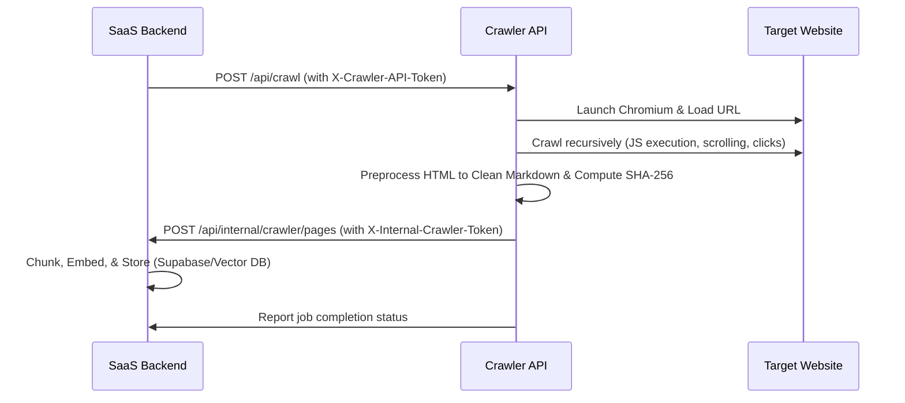

# Generic RAG Knowledge Crawler API

A production-ready FastAPI-based recursive web crawler that utilizes Playwright for JavaScript rendering, dynamic link discovery (menu hovers, button clicks, and SPA state tracking), clean HTML-to-markdown preprocessing, and real-time ingestion streaming.

## Overview
This service crawls a target website recursively and converts pages to cleaned markdown on the fly. Rather than storing markdown locally or interacting directly with databases, it instantly streams the clean markdown content and extraction metadata to a SaaS backend ingestion endpoint.

---

## Architecture Flow



---

## API Endpoints

### 1. `GET /health`
- **Description**: Public health status endpoint.
- **Authentication**: None.
- **Response**: `{"status": "healthy"}`

### 2. `POST /api/crawl`
- **Description**: Queues and starts a recursive crawl job.
- **Authentication**: Requires header `X-Crawler-API-Token`.
- **Payload**:
  ```json
  {
    "url": "https://example.com",
    "tenant_id": "94380aa5-4e36-45b0-8892-eb2f91cc9a1f",
    "agent_id": "758d0c23-d51c-4da5-b621-68ce723f62b2",
    "max_depth": 1,
    "max_pages": 10
  }
  ```
- **Response**:
  ```json
  {
    "job_id": "309b589279e7",
    "status": "queued",
    "message": "Crawler started.",
    "target_url": "https://example.com/"
  }
  ```

### 3. `GET /api/crawl/{job_id}/status`
- **Description**: Returns the real-time status and telemetry of a crawl job.
- **Authentication**: Requires header `X-Crawler-API-Token`.
- **Response**: See [Example Status Response](#example-status-response) below.

---

## Security Notes
> [!IMPORTANT]
> **Client Isolation**: The frontend/client-side applications must never call this crawler directly.
> **Server-Side Authorization**: All crawler API tokens (`X-Crawler-API-Token` and `X-Internal-Crawler-Token`) must reside securely server-side.
> **Safe Configuration**: Never commit `.env` files containing real secrets to git. Always use `.env.example` as a template.

---

## Environment Variables

| Variable | Description |
| :--- | :--- |
| `SAAS_BACKEND_URL` | Base URL of the SaaS Backend API (e.g., `https://api.nexora.com`). |
| `CRAWLER_INTERNAL_TOKEN` | Token sent to SaaS Backend in the `X-Internal-Crawler-Token` header. |
| `CRAWLER_API_TOKEN` | Token required in incoming requests to the Crawler API in the `X-Crawler-API-Token` header. |
| `MAX_BACKEND_SEND_CONCURRENCY` | Maximum concurrent HTTP sends to the SaaS backend (default: `3`). |
| `MAX_BACKEND_FAILURE_RATE` | Ratio of failed page sends to abort crawling (default: `0.8`). |
| `MIN_SEND_ATTEMPTS_BEFORE_ABORT` | Minimum send attempts before evaluating failure abort rate (default: `5`). |
| `PORT` | Port binding for the Uvicorn FastAPI server (default: `8765`). |

---

## Local Setup

### 1. Install Dependencies
```bash
pip install -r requirements.txt
playwright install --with-deps chromium
```

### 2. Configure Environment Variables
Copy `.env.example` to `.env` and fill in the values:
```bash
cp .env.example .env
```

### 3. Run FastAPI App
```bash
python main.py
```
The server will bind to `0.0.0.0` at the port specified (default: `8765`).

---

## Docker Setup

### Build Docker Image
```bash
docker build -t rag-crawler:latest .
```

### Run Container
```bash
docker run -d \
  -p 8765:8765 \
  -e SAAS_BACKEND_URL="https://your-saas-backend.com" \
  -e CRAWLER_INTERNAL_TOKEN="your_internal_token" \
  -e CRAWLER_API_TOKEN="your_api_token" \
  --ipc=host \
  rag-crawler:latest
```

---

## Render Deployment Steps

1. Create a **Web Service** on Render.
2. Connect your GitHub repository: `https://github.com/S-Sameer-Ahamad/WebCrawler.git`.
3. Select **Docker** as the Runtime.
4. Add the required environment variables in the Render Dashboard (under **Environment** settings).
5. Deploy. Render will automatically detect the `PORT` env variable and bind traffic accordingly.

---

## Example Curl Request for /api/crawl

```bash
curl -X POST http://localhost:8765/api/crawl \
  -H "Content-Type: application/json" \
  -H "X-Crawler-API-Token: replace_with_crawler_api_token" \
  -d '{
    "url": "https://example.com",
    "tenant_id": "94380aa5-4e36-45b0-8892-eb2f91cc9a1f",
    "agent_id": "758d0c23-d51c-4da5-b621-68ce723f62b2",
    "max_depth": 0,
    "max_pages": 1
  }'
```

---

## Example Status Response

```json
{
  "job_id": "29b2fdfdc2eb",
  "status": "COMPLETED",
  "created_at": "2026-06-19T13:49:01.537796",
  "updated_at": "2026-06-19T13:50:13.871626",
  "crawled_pages": 1,
  "sent_pages": 1,
  "failed_sends": 0,
  "rejected_urls": 2,
  "skipped_duplicates": 0,
  "current_url": "https://example.com/",
  "last_error": null,
  "menus_interacted": 1,
  "clicks_interacted": 1,
  "nav_links_found": 0,
  "click_links_found": 0,
  "hash_links_found": 0,
  "navigation_links_found": 0,
  "onclick_links_found": 0,
  "discovered_urls": 1,
  "completed_at": "2026-06-19T13:50:13.871626"
}
```

---

## MVP Limitations
- **In-Memory Tracking**: Job states are managed in RAM. If the container restarts or redeploys on Render, active job histories will be reset.
